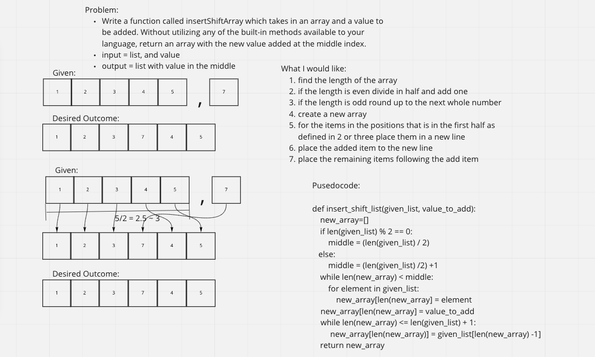

# Reverse an Array
- a function that takes in an array and a value and returns an array with the value added to the middle of the array

## Whiteboard Process

## Approach & Efficiency
- approach was interating over the first "half" placing the new value and then interating over the last "half"
- O(N)
