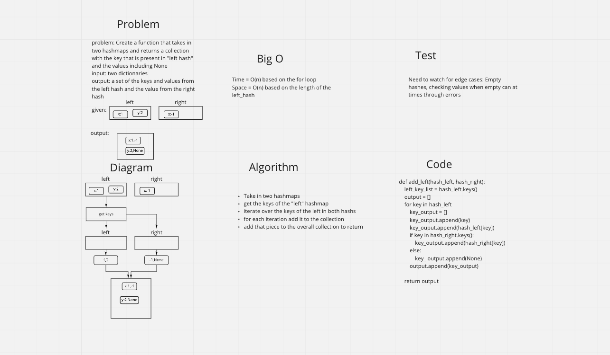

## Challenge
- Create a function that takes in two hashmaps that returns a collection with the key and the values from both hashs

## WhiteBoard

## Approach & Efficieny
- I decided to use the python dict for the hash table in my function. I just checked to see if each word was in the keys of the dict.

- Time = O(n) due to length of the hashmap the for loop
- Space = O(n) array that is created from the keys of the hashmap

## API
- No APIs used
