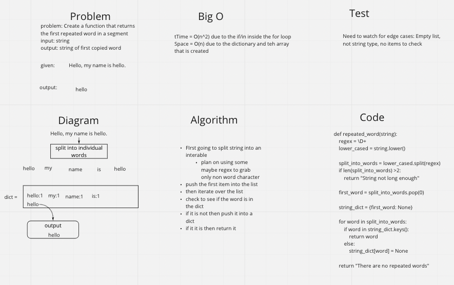

## Challenge
- Create a function that takes in a string and returns the first dupicated word in the string

## WhiteBoard

## Approach & Efficieny
- I decided to use the python dict for the hash table in my function. I just checked to see if each word was in the .keys() of the dict.

- Time = O(n^2) due to the if/in inside the for loop
- Space = O(n) due to the dictionary and teh array that is created

## API
- No APIs used
