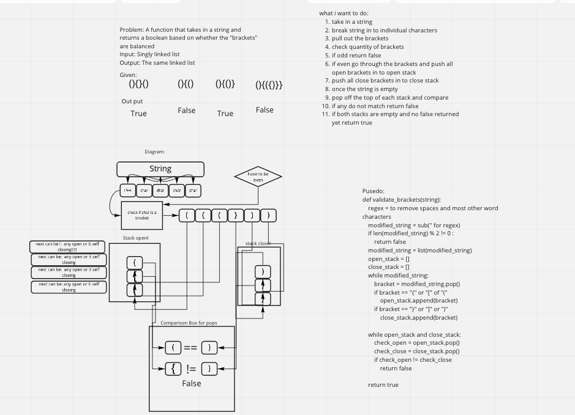

## Challenge
- Create a function that takes in a string and returns a boolean based on whether the brackets are balanced or not.

## Whiteboard

## Approach & Efficiency
- created two stack like lists that would capture the brackets and where they are in the list
- validate has time complexity of O(N) and space complexity of 0(N)

## API
- No Apis used
