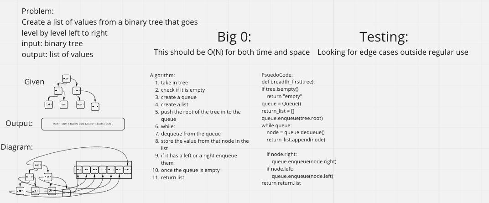

## Challenge
- Create a function that takes in a tree and returns a list of all values in the list but stepping through the levels

## Whiteboard

## Approach & Efficiency
- Followed the examples from class and the Code Fellows reading about binary trees as inspriation. I switched to a list construction after having problems with my enq method to my queue
- breadth_first has time complexity of O(N) and space complexity of O(N)

## API
- No Apis used
