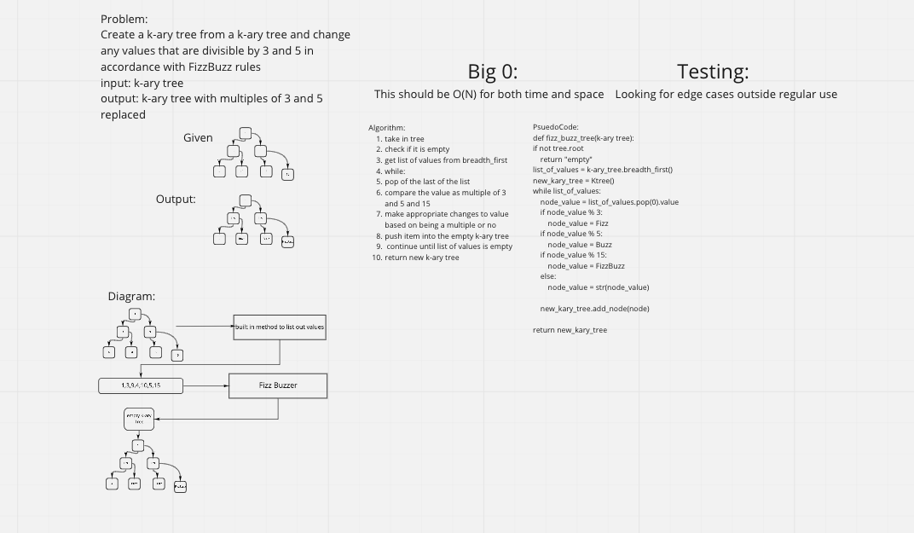

## Challenge
- Create a function that takes in a k-ary tree and returns a new K-ary tree with Fizz replacing all mutiples of 3, Buzz replacing all multiples of 5, and FizzBuzz replacing multiples of both 3 and 5.

## Whiteboard

## Approach & Efficiency
- Followed the examples from class and the Code Fellows reading about binary trees as inspriation. I first built a k-ary tree class along with a Knode class. The knode had an attribute of children that was an empty list. The k-ary took in a value that sets the k value for that tree.
- tree_fizz_buzz has time complexity of O(N) and space complexity of O(N)

## API
- No Apis used
