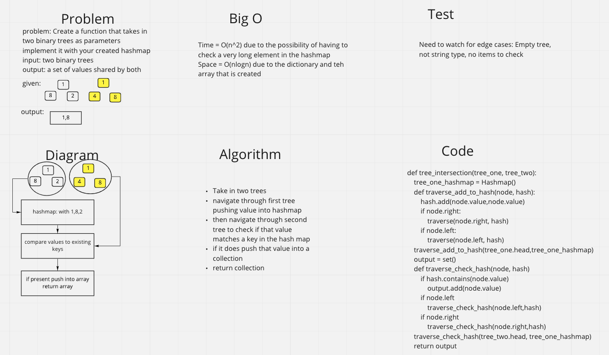

## Challenge
- Create a function that takes in two binary trees and returns a collection of values that are duplicated

## WhiteBoard

## Approach & Efficieny
- I relied on the built in methods in my implemented binary tree and binary search tree. The binary tree has the ability to print out the values of the tree. The binary search tree had the ability to quickly add values to the tree. I did not use any of the structure of the binary tree to my benefit. I then added one of the trees values to the hashmap. Then I checked the second list against the hashmap and if it was there I added it to the collection

- Time = O(n^2) due to the contains inside the for loop
- Space = O(n) due to the hashmap and the array that is created

## API
- No APIs used
