# Insertion Sort
## Basic but powerful

### What it is:
- A method of sorting elements by comparing it to previous elements in an array

### What does some psudeo-code for an insertion sort look like?
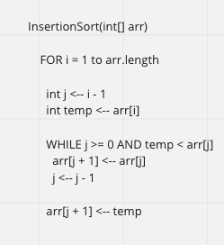
- Lets break this down piece by piece:
- `FOR i = 1 to arr.length`
    - we are saying we are going to be moving along the index of the array but starting at the index of 1 instead of the normal 0. At least for the value of `i`
- `int j <-- i - 1`
    - creates a variable `j` that will be one less than `i`
- `int temp <-- arr[i]`
    - creates a variable `temp` which will be the value of the element in the array at index of `i`
- `WHILE j>= 0 AND temp < arr[j]`
    - starts a while loop with two conditionals:
        - `j >= 0`
            - this conditional is true if `j` is equal or greater than 0
            - this allows for j to be all values of the indexs of the array but not below zero
        - `temp < arr[j]`
            - this conditional is true if `temp` is less than the value of the element in the array at index of `j`
            - this is what helps set up the order we want to sort by
                - in this case it is a increasing from lower index to hight index
- `arr[j+1] <-- arr[j]`
    - this sets the value of the array at index of `j + 1` to the value of array at index of `j`
- `j <-- j - 1`
    - this resets the value of `j` to `j-1`
    - it also is the decrementor for the while loop
    - this is what moves our conditional `temp < arr[j]` through the array
- `arr[j + 1] <-- temp`
    - this sets the value of the array at index of `j + 1` to the value of temp
    - the algorithm has manipulated j in such a way that when adding a one to it will mean `j+1` is the correct location for that value in the collection of values

### Lets look at an example step by step:

#### Step 1
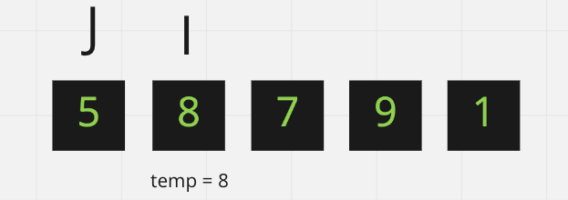
- We are given this set of values that are not sorted in ascending order
- We enter the `FOR` loop for the first iteration
- The `i` above the eight box shows it is at the 1 index
    - `FOR i = 1 to arr.length`
- The `j` above the five box shows it is one less in the index than `i`
    - ` j <-- i - 1`
- The `temp = 8` below the eight box shows the value of the array at the index of `i`
    - `int temp <-- arr[i]`
- With that we are set up to enter move on to the `WHILE` loop

#### Step 2
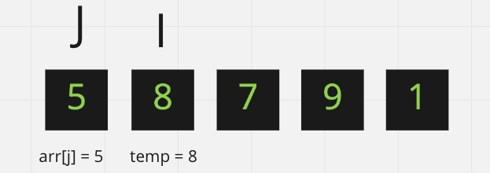
- First check the conditionals for the while loop
    - `j >= 0`
        - this is true `j` is 0
    - `temp < arr[j]`
        - this is shown to compare  `arr[j] = 5` and `temp = 8`
        - this is false so we do not enter the `WHILE` loop
- Second we set the value of `arr[j + 1]` to `temp`
    - `arr[j + 1] <-- temp`
    - This does not change anything visually because eight is already in that position, but do keep in mind that change does take place

#### Step 3
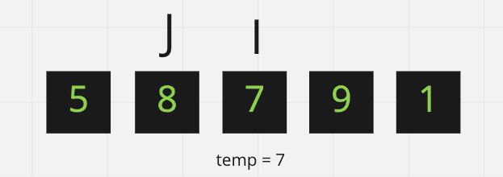
- We restart the `FOR` loop
- `i` has been incremented by one
- `j` is therefore one behind `i` again
- `temp` agains holds the value of the array at the index of `i`
- The algorithm moves toward the `WHILE` loop

#### Step 4
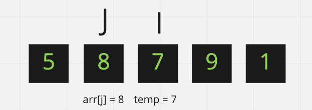
- First check the conditionals for the while loop
    - `j >= 0`
        - this is true `j` is 1
    - `temp < arr[j]`
        - this is shown to compare  `arr[j] = 8` and `temp = 7`
        - this is true so we enter the `WHILE` loop

#### Step 5
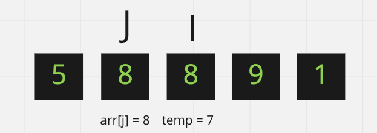
- The first action inside the `WHILE` loop is to set `arr[j+1] = arr[j]`
    - This is why there are two eights

#### Step 6
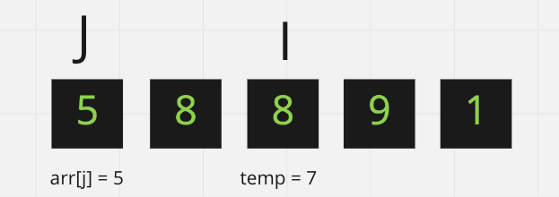
- Then we decrement `j` by one
    - `j <-- j - 1`
- We then check the conditionals at the top of the `WHILE` loop
    - `j >= 0`
        - this is true `j` is 0
    - `temp < arr[j]`
        - this is shown to compare  `arr[j] = 5` and `temp = 7`
        - this is false so we do not enter the `WHILE` loop

#### Step 7
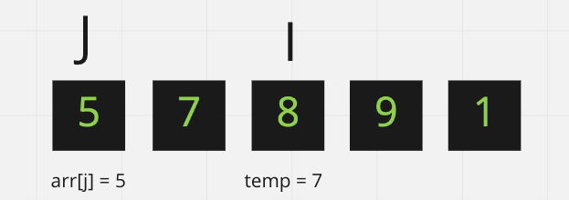
- Next is setting the value of `arr[j+1]`
- We know from the conditional that anything in a lower index should be lower than the `temp` value and any hight index should be greater
    - `arr[j + 1] <-- temp`

#### Step 8
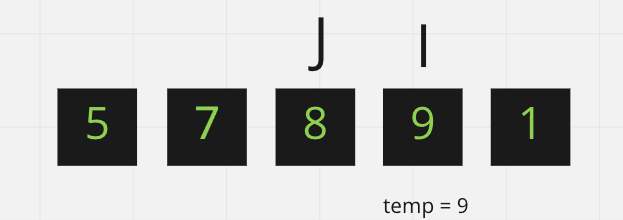
- We return to the top of the `FOR` loop
- We increment `i` again and create the varibles `j` and `temp` accordingly
- This iteration of the `FOR` loop does not enter the `WHILE` loop due to nine already being in the correct location realitve to the elements with lower indexs
- Again we set `arr[j+1]` to `temp` nothing seemingly happens because it was in the same position

#### Step 9
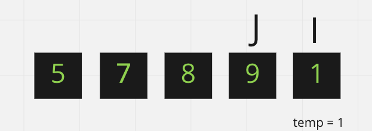
- We again move to the top of the `FOR` loop
- Increment `i` and set `j` and `temp`

#### Step 10
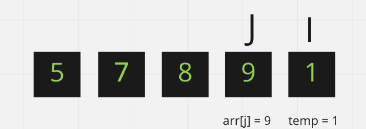
- We then check the conditionals at the top of the `WHILE` loop
    - `j >= 0`
        - this is true `j` is 3
    - `temp < arr[j]`
        - this is shown to compare  `arr[j] = 9` and `temp = 1`
        - this is true so we enter the `WHILE` loop

#### Step 11
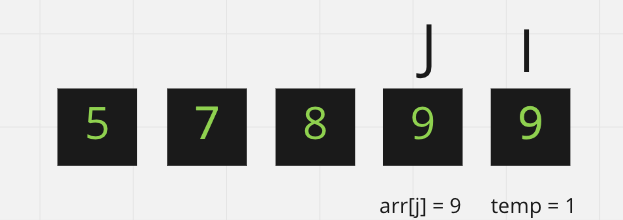
- The first action inside the `WHILE` loop is to set `arr[j+1] = arr[j]`
    - This is why there are two nines

#### Step 12

- Then we decrement `j` by one
    - `j <-- j - 1`
- We then check the conditionals at the top of the `WHILE` loop
    - `j >= 0`
        - this is true `j` is 2
    - `temp < arr[j]`
        - this is shown to compare  `arr[j] = 8` and `temp = 1`
        - this is true so we enter the `WHILE` loop

#### Step 13
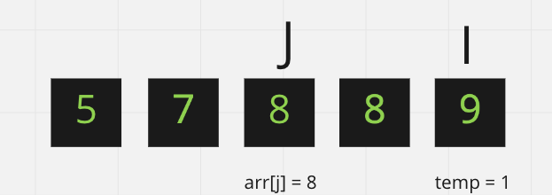
- The first action inside the `WHILE` loop is to set `arr[j+1] = arr[j]`
    - This is why there are two eights

#### Step 14
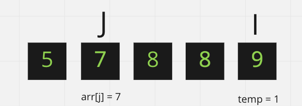
- Then we decrement `j` by one
    - `j <-- j - 1`
- We then check the conditionals at the top of the `WHILE` loop
    - `j >= 0`
        - this is true `j` is 1
    - `temp < arr[j]`
        - this is shown to compare  `arr[j] = 7` and `temp = 1`
        - this is true so we enter the `WHILE` loop

#### Step 15
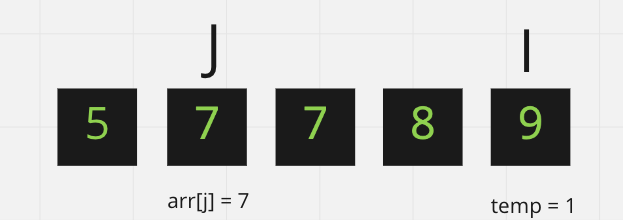
- The first action inside the `WHILE` loop is to set `arr[j+1] = arr[j]`
    - This is why there are two sevens

### Step 16
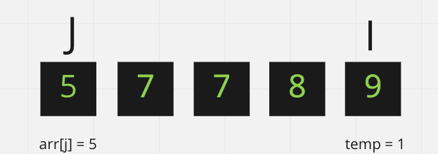
- Then we decrement `j` by one
    - `j <-- j - 1`
- We then check the conditionals at the top of the `WHILE` loop
    - `j >= 0`
        - this is true `j` is 0
    - `temp < arr[j]`
        - this is shown to compare  `arr[j] = 5` and `temp = 1`
        - this is true so we enter the `WHILE` loop

#### Step 17
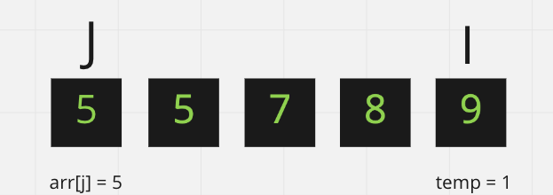
- The first action inside the `WHILE` loop is to set `arr[j+1] = arr[j]`
    - This is why there are two fives

#### Step 18
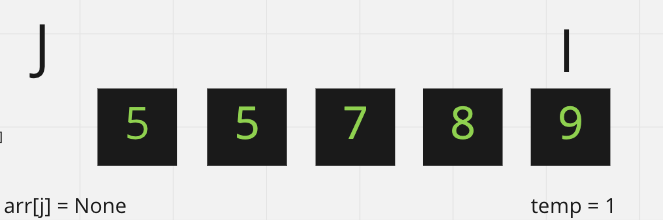
- Then we decrement `j` by one
    - `j <-- j - 1`
- We then check the conditionals at the top of the `WHILE` loop
    - `j >= 0`
        - this is false `j` is -1
- This kicks us out of the loop

#### Step 19
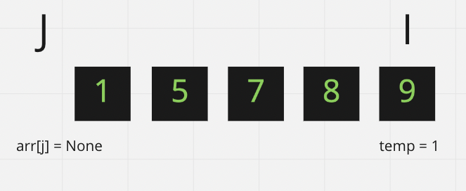
- `arr[j + 1] <-- temp`
- We set `arr[0]` to `temp`
- We have finished the `FOR` loop

