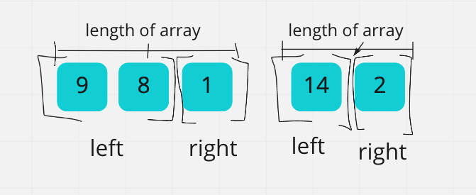

# Welcome Back!
## More Sorts

### Todays Sort:
### Merge Sort

### Let's Start with the pseudo code again:

- First thing to notice is there are two algorithm in the picture:
1. Let's walk through the algorithm on the left first `Mergesort`
    - This algorithm takes in a array and looks to manipulate it in place. It does not explicity return anything
    - `DECLARE n <-- arr.length`
        - storing the  value of the length of the array in the variable `n`
    - `if n > 1`
        - a conditional relating to `n`, this is setting our base case for or recursive calls coming up
    - `DECLARE mid <-- n/2`
        - stores the value of half the length of the array in the variable `mid`
    - `DECLARE left <-- arr[0...mid]`
        - stores the value of the array from the beginning to just before the array at the index of `mid` in `left`
    - `DECLARE right <-- arr[mid...n]`
         - stores the value of the array at the index of `mid` to the end of the array in `right`
    - `Mergesort(left)`
        - this is the recursive call that I mentioned before. It will perform the same operations of this algorithm but only on the `left` part of the array
    - `Mergesort(right)`
        - It will perform the same operations but only on the `right` part of the array. Both of these mergesorts will manipulate the array passed in and sort them
    - `Merge(left, right, arr)`
        - this is where we call the other function. Notice we pass in `left`,`right`, and the original array `arr`
    - That is the `mergesort` algorithm. I like to think of this part as set up part or the "cutting of the vegatables" before the real work gets going

    
2. Lets get to the cooking part with a look at the algorithm on the right `Merge`

    - This algorithm takes in three things. We know from the algorithm above all the arguements are arrays and that `left` and `right` are pieces of `arr`

    - `DECLARE i <-- 0`, `DECLARE j <-- 0`, `DECLARE k <-- 0`
        - This is the creation of several variables that will help track the index in the different arrays we are working with
     - `while i < left.length && j < right.length`
        - this is the conditional on the `while` loop that will end the loop if the index of one of the `left` or `right` arrays goes beyond its range
    - `if left[i] <= right[j]`
        - this checks to see if the value of the `left` array at the index of `i` is less than the `right` array at the index of `j`
    - `arr[k] <-- left[i]`
        - if the above conditional was meet then the total array `arr` at the index of `k` is reset to the value of the `left` array at the index of `i`
    - `i <-- i + 1`
        - then `i` will be incremented to set for the next run through the `while` loop
    - `else`
        - if `left[i]` is not less than or equal to `right[j]` the next block of code will run

    - `arr[k] <-- right[j]`
        - if the above conditional was meet then the total array `arr` at the index of `k` is reset to the value of the `right` array at the index of `j`
    - `j <-- j + 1`
        - then `j` will be incremented to set for the next run through the `while` loop
    - `k <-- k + 1`
        - this runs every time through the `while` loop. It increments to move the index of the `arr` array
    - `if i = left.length`
        - this is the final conditional in the algorithm. It is outside of the `while` loop. This checks to see if the `while` loop was ended because `i` was incremented to the edge of its range
    - `set remaining entries in arr to remaining values in right`
        - if the above is true it means the remaining values in the `right` array should be place as is because they are already sorted
    - `else`, `set remaining entries in arr to remaining values in left`
        - this is for the scenario that the `while` loop ended because 'j' went to the edge of its range

### Lets take a look at an example:
#### Step 1

#### Step 2

#### Step 3

- There is a lot of brackets and lefts and rights in these pictures. Lets break it down. This is the "chopping up the vegatables" from `Mergesort`. You can see the recursive nature of `Mergesort`. Step three is if you drilled down to the bottom of the recursive process. It would not look like this exactly because the innermost brackets would have to resolve before we could see any of the rights. But really notice how the function is cutting the array down in to pieces of lengths of 1. Remind you of the `n>1` conditional in `Mergesort`

#### Step 4

- let us take a look at the smallest case of the `Merge` algorithm
#### Step 5

- We use our variables for indexs in all of our arrays. We then compare the values at those indexes
#### Step 6

- Because the value of `right[j]`(8) is less than the value of `left[i]`(9), we set the value of `arr[k]` to `right[k]`(8)
- we also increment `j` by one
- with that increment the while loop ends
#### Step 7

- The final if/else statement is run
    - this sets the remaining part of `left` array for the rest of the `arr`array.

#### Step several more along

- Now lets take a look at the last time `Merge` is run in the original `Mergesort` call. The `left` and `right` have been sorted due to their own `Mergesort` calls.

#### Final Merge Step 1

- we set all the variables to the indexs of our arrays
- we compare the value of the `left` and `right` arrays.

#### Final Merge Step 2

- we then set the value of the `arr` to which ever is the lowest of the those values and increment the variable that was lowest

- This proccess continues until one of the arrays runs out of elements

- The reaming elements of the other array (in this case `right`) is placed at the end of the array
