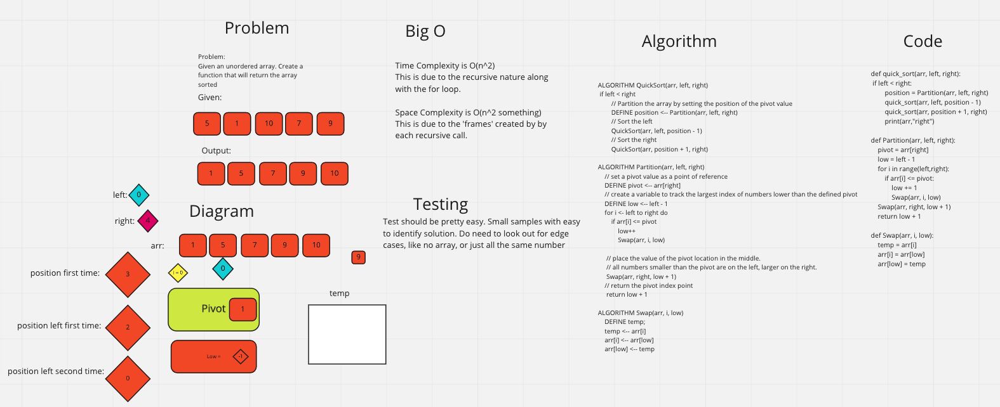

# Quick Sort
- a function that sorts a collection in a recursive manner. It does by choosing an arbitrary "pivot" value and sorts the collection into a section that is above the pivot and below the pivot. Those sections then go through the same thing.

## Whiteboard

## Challenge
- Translate the pseudo code and to test that code.

## Approach & Efficiency
- Time Complexity is O(n^2)
    -This is due to the recursive nature along with the for loop.

- Space Complexity is O(n^2 something)
    - This is due to the 'frames' created by by each recursive call.

## Attribution:
Chloe Nott
